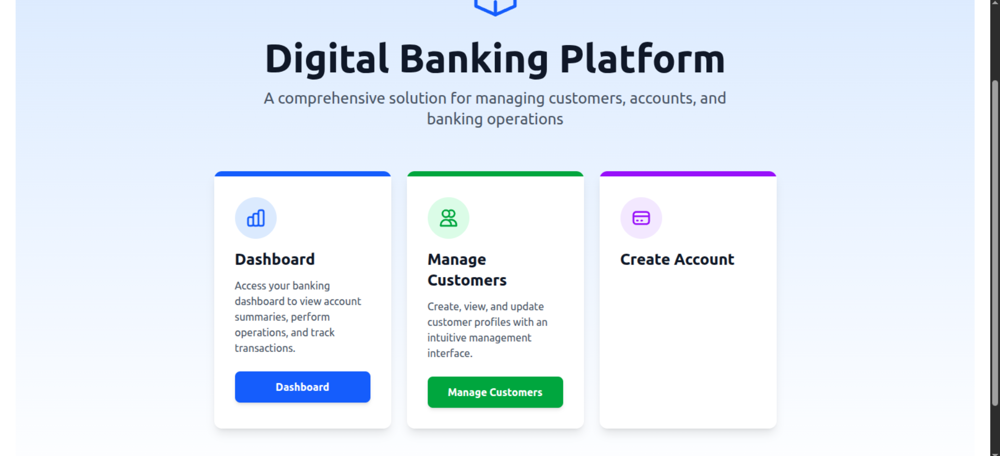
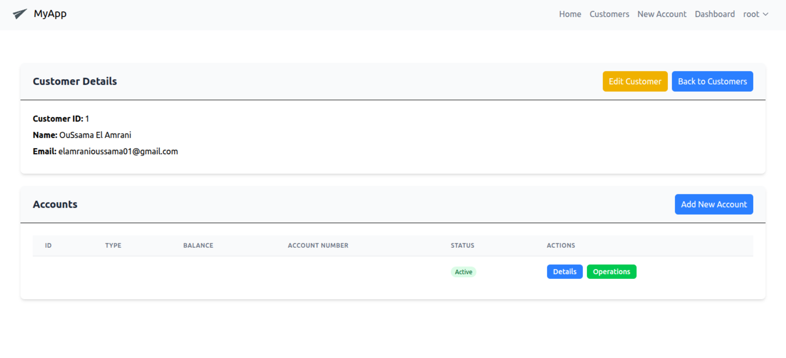
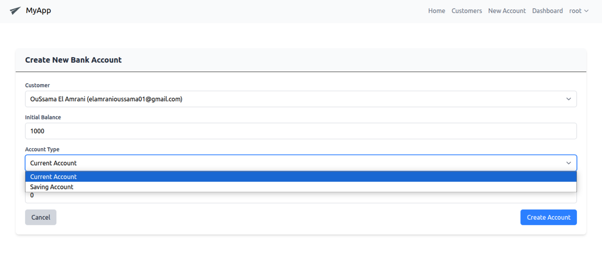

# Application de Banque Digitale

## Présentation

Cette application de banque digitale est une solution complète développée avec Angular pour le frontend et Spring Boot pour le backend. Elle permet la gestion des clients, des comptes bancaires et des opérations financières dans un environnement sécurisé.

## Fonctionnalités

- Gestion des clients (ajout, modification, suppression)
- Gestion des comptes bancaires (consultation, création)
- Réalisation d'opérations (dépôt, retrait, virement)
- Consultation de l'historique des opérations

## Technologies utilisées

- **Frontend**: Angular, Bootstrap
- **Backend**: Spring Boot, Spring Data JPA, Spring Security
- **Base de données**: MySQL/H2

## Captures d'écran

### Page d'accueil



### Liste des clients



### Détails des comptes



### Opérations bancaires


## Installation et démarrage

### Prérequis

- Java 11+
- Node.js et npm
- Maven

### Installation du backend

```bash
# Cloner le dépôt
git clone [URL_DU_REPO]

# Accéder au dossier backend
cd tp-digital-banking-Angular-springBoot/backend

# Installer les dépendances et compiler
mvn clean install

# Démarrer le serveur
mvn spring-boot:run
```

### Installation du frontend

```bash
# Accéder au dossier frontend
cd tp-digital-banking-Angular-springBoot

# Installer les dépendances
npm install

# Démarrer l'application
ng serve
```

L'application sera accessible à l'adresse: http://localhost:4200

## Structure du projet

### Backend

- Controllers REST pour exposer les API
- Services pour la logique métier
- Repositories pour l'accès aux données
- Entités JPA pour la modélisation des données

### Frontend

- Components Angular pour l'interface utilisateur
- Services pour communiquer avec le backend
- Models pour représenter les données
- Guards pour la sécurité
